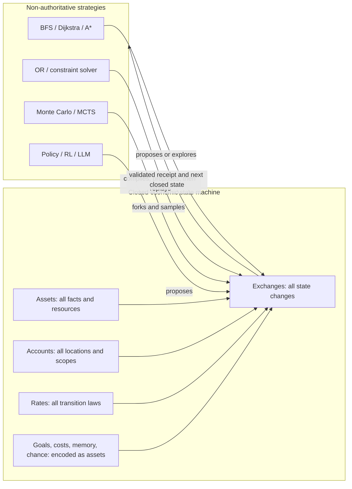

# Multiagent Closed Economic State Machine

## Product Design Document

| Field | Value |
| --- | --- |
| Status | Living design document |
| Product | `multiagent` Rust crate |
| Current crate version | `0.1.0` |
| Rust edition | 2024 |
| Minimum supported Rust version | 1.85 |
| Last updated | 2026-07-30 |
| Audience | Library contributors, problem modelers, solver authors, simulation designers, reinforcement-learning engineers, and future smart-contract implementers |

This document defines the product philosophy, the target computational model,
the current implementation, and the path between them.

The words **current implementation** describe behavior that exists in the
repository today. The words **target model** describe the design we are
building toward. This distinction is important: the current generic bilateral
ledger is a sound foundation, but it does not yet enforce every rule in this
document.

## 1. Executive summary

`multiagent` is intended to become a closed economic state machine in which
every semantically meaningful part of a problem is represented using four
fundamental concepts:

- Assets.
- Accounts.
- Rates.
- Exchanges.

The non-negotiable product rule is:

> Nothing semantically authoritative may live outside assets, accounts, rates,
> and exchanges.

Position, time, energy, graph connectivity, goals, constraints, permissions,
agent memory, uncertainty, lifecycle, planner statistics, and rewards are not
parallel forms of state. They must be encoded through the same economic
ruleset.

Algorithms such as BFS, Dijkstra, A*, constraint solvers, Monte Carlo
simulation, MCTS, reinforcement learning, or an LLM planner may operate over
the system. They are strategies for selecting, proposing, or exploring
exchanges. They are not alternative sources of truth.

The core validates reality:

> Solvers may propose. Only the asset/account/rate/exchange system defines and
> applies valid state transitions.

This makes the project more than a trading ledger and different from a generic
simulation framework with an economic component. The ledger is not one field
inside an external world object. The complete world is the closed economic
state.

## 2. Fundamental closure axioms

### 2.1 Closed semantic state

At a point in time, complete authoritative state is a mapping:

```text
State = Account × Asset → Quantity
```

The problem definition is:

```text
Problem = Initial state + Available rates
```

Computation is:

```text
Computation = A sequence of valid exchanges
```

A goal is:

```text
Goal = A desired asset configuration
```

A solution is:

```text
Solution = An exchange trace that reaches a goal configuration
```

No additional world state may secretly influence which exchanges are valid or
what effects they have.

### 2.2 Exchange-only mutation

Every semantic state change must be representable as an exchange firing a
rate.

Initialization may construct an initial state, but after execution begins:

- Position cannot change through an external assignment.
- An agent cannot die by setting an external Boolean.
- A task cannot complete through an unrecorded callback.
- A random outcome cannot alter hidden state without an exchange.
- A solver cannot directly install its proposed answer.

Every effect must become visible as asset movement or transformation and must
produce evidence that can be audited or replayed.

### 2.3 Solver non-authority

External algorithms are permitted to:

- Inspect a view derived from the closed state.
- Enumerate or prioritize applicable exchanges.
- Fork states for search or simulation.
- Compile bounded problems into another solver representation.
- Propose an exchange or exchange sequence.
- Cache information that is fully derivable from core state.

External algorithms are not permitted to:

- Maintain authoritative domain state unavailable to the core.
- Introduce a constraint that the rate system cannot validate.
- Apply an effect without an exchange.
- Return a solution that cannot be replayed through the core.

An external solver is an untrusted accelerator. The accepted answer is the
validated exchange trace, not the solver's internal assignment.

### 2.4 Reconstructability

Given the initial state, available rates, and exchange receipts, the semantic
state must be reconstructible.

If deterministic replay also depends on:

- A random seed.
- A learned agent's memory.
- A planning budget.
- A preference ordering.
- A hidden fact.

then that information must be encoded in accounts and assets or recorded as
part of the exchange history.

### 2.5 No opaque-world escape hatch

The closure principle would be meaningless if a user could serialize an entire
external world into one opaque asset and let an arbitrary callback update it.

A useful encoding should be:

- **Closed:** no authoritative semantic state exists elsewhere.
- **Structured:** assets represent explicit facts, resources, conditions, or
  capabilities rather than an opaque world blob.
- **Local:** a rate touches a comprehensible portion of state.
- **Composable:** independently modeled subsystems interact through shared
  assets and accounts.
- **Inspectable:** effects are understandable from exchanges and receipts.
- **Replayable:** a trace reconstructs semantic state.
- **Solver-neutral:** the problem does not depend on one search algorithm.
- **Verifiable:** a proposed solution can be replayed through the core.

The goal is not merely to encode a problem somehow. The goal is to preserve
enough structure that reasoning algorithms can exploit and humans can inspect
it.

## 3. Meaning of the four primitives

The economic vocabulary is intentionally broader than financial trade.

| Primitive | General meaning |
| --- | --- |
| Asset | A resource, fact, proposition, capability, condition, permission, measurement, memory token, or state token |
| Account | An owner, actor, location, scope, branch, namespace, or context in which assets exist |
| Rate | A law specifying which asset configuration may become another |
| Exchange | A concrete binding and firing of a rate; therefore an event and state transition |

A useful mnemonic is:

- Assets are the nouns.
- Accounts answer “where?” or “whose?”
- Rates are the laws or verbs.
- Exchanges are the events.

`Quantity` and `Basket` are implementation structures supporting these
fundamental concepts. A basket is a finite collection of asset quantities.

## 4. Product thesis

### 4.1 Economic state is the universal interface

Many apparently different problem domains can be described through ownership,
location, availability, scarcity, capability, and transformation.

Assets need not be money. They can represent:

- Physical resources.
- Time and deadlines.
- Graph position.
- A valid edge or movement permission.
- A job that is scheduled or unscheduled.
- A machine time slot.
- A logical proposition.
- A goal condition.
- Reputation or belief.
- Random state.
- Search frontier membership.
- A parent relationship in a search tree.
- Accumulated cost or utility.

A single explicit state surface makes the system inspectable, replayable, and
available to multiple reasoning methods.

### 4.2 User-defined ontology, core-defined reality

The kernel cannot know all possible asset or account types. Applications
therefore define ordinary Rust types describing their ontology.

This does not mean applications may keep parallel semantic state. It means they
define the vocabulary used inside the closed system.

For example:

```rust
enum Asset {
    At(NodeId),
    Edge(NodeId, NodeId),
    Energy,
    Goal(NodeId),
    Solved,
}
```

The enum type is defined by the user. Instances of those assets, their
locations, quantities, and transitions belong to the core state.

### 4.3 Mechanism and selection strategy remain separate

The core answers:

> Which exchanges are valid, and what exact state does an exchange produce?

A solver or policy answers:

> Which valid exchange or branch should be considered next?

This separation permits many algorithms to reason over identical semantics.
Unlike the earlier design, it does not permit the policy to carry an unrelated
authoritative world state.

### 4.4 Failure is part of the model

Rejected exchanges are meaningful outcomes:

- A resource is missing.
- A precondition is false.
- A destination is unavailable.
- A constraint cannot be satisfied.
- Arithmetic would overflow.

Failure must be structured and atomic. It should be usable for action masking,
search pruning, debugging, learning signals, and adversarial validation.

### 4.5 Formal claims follow formal laws

The project is inspired by economic algebra, multiset rewriting, Petri nets,
linear logic, and category theory. These inspirations do not automatically
make the implementation a formal instance of any of those structures.

We will claim identities, composition, associativity, conservation, or formal
correctness only after:

1. Defining the relevant objects and operations.
2. Stating their laws.
3. Testing them against a reference model.
4. Proving them when the product requires proof.

We earn abstraction through laws, not terminology.

## 5. The problem we are solving

Traditional systems divide one problem across unrelated representations:

- A graph stores connectivity.
- An object stores position.
- A scheduler stores task assignments.
- A ledger stores resources.
- A termination callback stores the goal.
- A solver stores cost and feasibility.
- A simulator stores time and randomness.

The boundaries between those representations become the hardest part to
reason about. A solver may optimize constraints that execution does not enforce.
A simulation may mutate state that cannot be reconstructed from its event log.
A reward function may depend on hidden state unavailable to another policy.

`multiagent` aims to encode the complete problem space into one transition
language.

The original repository made a different mistake: it put one specific problem
directly into the library through hardcoded assets and behavior. The first
generic refactor removed those hardcoded types and made bilateral exchange
atomic, but it treated policy and lifecycle state as application-owned values
outside the ledger.

The next evolution preserves the generic foundation while enforcing closure.

## 6. Product goals

### 6.1 Immediate goals

- Declare closed semantic state as a non-negotiable design rule.
- Keep assets and account identifiers user-defined.
- Make every semantic transition an exchange.
- Make exchanges atomic, checked, inspectable, and replayable.
- Replace unconstrained behavior context with core-derived views.
- Encode goals and lifecycle as asset configurations.
- Remove or constrain mutation paths that bypass exchanges.
- Generalize bilateral trade toward structured multiset rewriting.
- Preserve the existing economic use case as a special case.
- Prove the model with a completely closed pathfinding example.

### 6.2 Long-term goals

- Encode finite search, planning, allocation, scheduling, and simulation
  problems entirely through the four primitives.
- Allow BFS, Dijkstra, A*, OR solvers, Monte Carlo methods, MCTS, RL, and other
  strategies to operate over the same semantics.
- Support deterministic forks, snapshots, replay, and exchange traces.
- Model uncertainty through explicit assets, rates, and a Nature actor.
- Define declared invariants for transformations.
- Support multi-account and parameterized rates.
- Add property-based, model-based, and eventually formal verification.
- Evaluate a deterministic execution profile for smart contracts or WASM.

### 6.3 Non-goals today

- Claiming theoretical universality before the semantics support it.
- Replacing mature solver implementations.
- Hiding external callbacks inside opaque assets.
- Becoming a production financial ledger in version `0.1`.
- Providing identity, signatures, consensus, or distributed transactions.
- Selecting one universal objective or reward function.
- Optimizing performance before transition semantics stabilize.

## 7. Closed-system architecture



There is no independent `WorldState` beside the machine. A solver's internal
heap, SAT clauses, or rollout tree may accelerate computation, but the problem
semantics and accepted result remain inside the four primitives.

## 8. Target state and transition semantics

### 8.1 State as a marking

The complete state can be viewed as a sparse matrix:

```text
S(account, asset) = quantity
```

This is similar to a marking in a token system. Accounts provide location or
scope; assets provide typed meaning; quantities provide multiplicity.

### 8.2 Rates as multiset rewrite laws

The current `Rate<A>` is a bilateral credit/debit pair. The target rate is more
general. It needs to describe:

- Assets consumed from account roles.
- Assets produced into account roles.
- Assets required but preserved.
- Role bindings to concrete accounts.
- Asset or term-variable bindings.
- Units or multiplicity.
- Declared invariants.

Conceptually:

```text
Rate
├── consume: role × asset-pattern → quantity
├── produce: role × asset-template → quantity
├── preserve: role × asset-pattern → quantity
├── bindings and constraints
└── declared invariants
```

A bilateral trade remains a valid special case:

```text
consume buyer: Coin × 2
consume seller: Time × 1
produce buyer: Time × 1
produce seller: Coin × 2
```

A state transformation is also expressible:

```text
consume agent: At(A)
consume agent: Energy × 3
preserve world: Edge(A, B)
produce agent: At(B)
produce metrics: EnergySpent × 3
```

### 8.3 Exchanges as bound rate firings

A first-class exchange identifies:

- The rate being fired.
- Account-role bindings.
- Asset or term bindings.
- Units.
- Any explicitly modeled choice, including a chance outcome.

Conceptually:

```text
Exchange
├── rate
├── account bindings
├── asset bindings
└── units
```

Applying an exchange:

1. Resolves every binding.
2. Checks every required and preserved asset.
3. Checks all quantities and declared constraints.
4. Computes all account deltas.
5. Verifies arithmetic and invariants.
6. Commits every affected account atomically.
7. Returns a receipt containing the complete semantic effect.

### 8.4 Absence must be explicit

Rules based on hidden absence are difficult to inspect and may increase the
computational model's power in surprising ways.

For bounded problems, absence should normally be represented by an explicit
complementary asset:

```text
Unvisited(Node)
Empty(Slot)
Alive(Agent)
Unassigned(Job)
```

A rate consumes the prior condition and produces its successor:

```text
Unvisited(B) → Visited(B)
Alive(A) → Dead(A)
Empty(T) + Unassigned(J) → Occupied(T, J) + Assigned(J, T)
```

Whether the target model eventually supports inhibitor arcs, zero tests, or
guards remains an explicit open question.

## 9. Conservation and transformation

### 9.1 Current law

The current bilateral implementation transfers debit and credit baskets
between buyer and seller. It conserves the global quantity of each literal
asset involved:

```text
B′ = B - Dₙ + Cₙ
S′ = S - Cₙ + Dₙ
B′ + S′ = B + S
```

This is correct for trade.

### 9.2 Why literal conservation is not the universal law

General problem transitions often change asset identities:

```text
At(A) → At(B)
Wood + Labor → Chair
Unvisited(Node) → Visited(Node)
Alive → Dead
```

Requiring every literal asset to be globally conserved would force all output
tokens to be pre-stocked in reservoir accounts. That can encode bounded
problems but obscures their meaning and makes the system artificially rigid.

### 9.3 Target law: declared invariants

The target model should support linear or typed invariants appropriate to the
problem.

For pathfinding:

```text
Σ At(any_node) = 1
```

Moving from `At(A)` to `At(B)` preserves exactly one position token even though
the literal asset changes.

For traditional trade:

```text
global quantity of each traded asset is unchanged
```

For production:

```text
declared mass, value, capability, or accounting dimensions are preserved
```

Minting, burning, and intentionally non-conservative transformations must be
explicit rate semantics rather than mutation escape hatches.

This is one of the most important design transitions ahead: conservation
remains central, but it becomes a declared law over asset dimensions rather
than an accidental requirement that every asset identity remain unchanged.

## 10. Encoding problem concepts

### 10.1 Facts and propositions

A fact is an asset held by the account whose scope makes the fact true:

```text
Node(A) owns OccupiedBy(Agent)
Agent(A) owns HasCapability(Fly)
World owns Edge(A, B)
Task(T) owns Incomplete
```

### 10.2 Location

Location can be encoded either as:

- An `At(Node)` asset held by an agent account, or
- A `Presence(Agent)` asset held by a node account.

The second form makes accounts literal places. The first makes an agent account
the single locus of its state. Both remain inside the model.

### 10.3 Immutable or catalytic facts

An edge, law, permission, or capability may be required without being consumed.
It can appear as a preserved asset in a rate:

```text
preserve world: Edge(A, B)
```

In a simpler implementation, the same asset may appear on both the consumed
and produced sides of one atomic rate.

### 10.4 Goals and terminal state

A goal must be represented by assets or by a rate that produces a goal asset:

```text
Presence(Agent) at GoalNode → Solved
MissionTime unavailable + Alive → Dead
AllJobsAssigned → ScheduleComplete
```

Termination is the presence of a terminal configuration, not an arbitrary
external predicate over hidden state.

### 10.5 Costs, utility, and preference

Costs can be consumed assets or accumulated measurement assets:

```text
TimeSpent
EnergySpent
Risk
Utility
Violations
```

A solver may prioritize states using these balances. If a preference weighting
changes the semantic answer, that weighting must itself be encoded as assets or
rates rather than hidden in a callback.

Multiple objective assets allow Pareto or lexicographic reasoning without
declaring one scalar reward universally correct.

### 10.6 Belief and partial observation

Ground truth and belief can live in different accounts:

```text
Nature account: true state
Agent account: observations and beliefs
```

Observation is an exchange governed by access and sensing rates. An agent
cannot inspect truth assets unless a valid rate makes them observable.

### 10.7 Randomness and Nature

Chance is modeled as another participant rather than hidden environment
mutation.

A `Nature` account can hold:

- Random seed state.
- Outcome weights.
- Hidden facts.
- Pending stochastic choices.

A Nature policy selects among applicable outcome rates. The selected outcome
is still an exchange and therefore appears in the receipt trace.

For exact replay, the seed, sampled choice, or both must be encoded or recorded.

## 11. Pathfinding as the first proof

Pathfinding is the next decisive validation because it is familiar, easily
checked, and not naturally described as financial trade.

### 11.1 Closed encoding

Possible assets:

```rust
enum Asset {
    Presence(AgentId),
    Edge(NodeId, NodeId),
    Goal(NodeId),
    Energy,
    Time,
    Open(StateId),
    Closed(StateId),
    Cost(StateId),
    Parent(StateId, StateId),
    Solved,
}
```

Possible accounts:

```rust
enum AccountId {
    Node(NodeId),
    Agent(AgentId),
    Search(SearchId),
    Branch(StateId),
    Environment,
    Goal,
}
```

A move rate consumes presence at one node and produces it at another while
checking edge availability and charging explicit cost assets.

The graph can be encoded:

- As one concrete movement rate per edge, or
- As `Edge(A, B)` assets used by parameterized movement rates.

There must be:

- No external position.
- No external graph state.
- No external goal predicate.
- No external cost state.
- No domain mutation outside exchanges.

The solution is a replayable exchange sequence ending in `Solved`.

### 11.2 Search state

A search node is a closed economic state. A search edge is an applicable
exchange.

```text
Economic state --exchange--> Economic state --exchange--> Economic state
```

BFS, Dijkstra, and A* explore the same state-transition graph with different
selection strategies.

An external priority queue is acceptable as a derived acceleration structure.
It must not contain unique semantic facts absent from the forked core states.
If search must be paused and exactly resumed, frontier membership, costs,
parents, and tie-breaking state should be materialized as assets and accounts
or recorded in a planner trace.

### 11.3 Acceptance criteria

The pathfinding milestone succeeds when:

- One closed encoding is solved by both BFS and A*.
- Both solvers produce exchange traces accepted by the same core.
- Replaying either trace reconstructs the same final semantic state.
- A* uses cost and heuristic information represented in or derived
  deterministically from core assets.
- Removing the solver's caches does not alter problem semantics.
- No position, topology, cost, or goal state lives in an external world object.

The goal is not simply to make pathfinding possible. The encoding must be
clear, local, compositional, and useful.

## 12. Traditional algorithms over the core

### 12.1 BFS, Dijkstra, and A*

These algorithms treat:

- A complete closed state as a search node.
- An applicable exchange as an outgoing edge.
- Cost assets as edge or accumulated path cost.
- A goal asset configuration as the terminal condition.

They differ in exploration order, not semantics.

### 12.2 Constraint and OR solvers

An OR adapter may compile a bounded closed economy into CP-SAT, MILP, routing,
or another solver representation.

The workflow must be:

1. Compile accounts, assets, rates, quantities, and goals.
2. Ask the external solver for a proposed assignment or plan.
3. Translate that proposal into exchanges.
4. Replay every exchange through the core.
5. Accept the result only if the complete trace validates.

The external assignment is not the solution of record. The validated exchange
trace is.

### 12.3 Monte Carlo simulation

A rollout is a forked closed state followed by sampled exchanges.

Every branch begins from an exact state snapshot. Every outcome becomes a
receipt. Rollout utility is represented by assets or a deterministic valuation
of assets.

### 12.4 Monte Carlo tree search

MCTS statistics can themselves be represented economically:

```text
Search-node account:
  VisitCount
  TotalUtility
  WinCount
  FailureCount
```

Tree branches can be accounts. Parent relationships, rollout budgets, and
selection statistics can be assets. A UCT implementation is a selection
strategy over this encoded state.

Temporary external indices are acceptable only when they are derived and
non-authoritative.

### 12.5 Reinforcement learning

An RL policy observes a permitted projection of account balances and proposes
an exchange.

Trajectories naturally become:

```text
(economic observation, proposed exchange, receipt or error, next observation)
```

Reward must be represented as assets produced or transformed by rates. A
solver may read those quantities through a generic strategy, but
domain-specific reward parameters cannot remain hidden in external state.

### 12.6 Game-theoretic and multi-agent methods

Multiple actors can propose competing, cooperative, or simultaneous exchanges.
Joint-action resolution must eventually be represented as atomic multi-account
rates rather than an external world update.

## 13. Computational expressiveness

With finite accounts, finite asset types, finite rates, and bounded `u64`
quantities, the system is a finite-state transition system.

That is already sufficient to represent many practical bounded problems:

- Pathfinding.
- Scheduling.
- Routing.
- Resource allocation.
- Constraint satisfaction.
- Turn-based games.
- Bounded planning.
- Finite stochastic simulations.

Any finite-state problem can be encoded degenerately with one asset per
complete state and one rate per transition:

```text
State0001 → State0002
```

That observation is not a product achievement. It hides structure and scales
poorly.

The product challenge is compact, compositional encoding through structured
assets and local rates.

Unbounded computational universality would require explicit decisions about:

- Dynamic accounts or assets.
- Unbounded quantities.
- Parameterized rate schemas.
- Variable matching and unification.
- Zero or absence tests.
- Recursion or rate generation.

Turing completeness is not an immediate goal. Useful, inspectable, and
verifiable modeling of bounded problems is more valuable than a theoretical
universality claim.

## 14. Current implementation

The current repository implements a correctness-oriented bilateral foundation.

### 14.1 What exists today

- `Quantity` is a private `u64` wrapper with checked arithmetic.
- `Basket<A>` is a sparse mapping from user-defined assets to quantities.
- `Account<A>` owns balances and provides atomic deposit and withdrawal.
- `Rate<A>` contains a buyer credit basket and debit basket.
- `Ledger<AccountId, A>` stores accounts.
- `Ledger::exchange` executes checked bilateral exchange atomically.
- `Receipt` records scaled credit and debit baskets.
- Structured errors report missing accounts, shortfalls, and overflow.
- Assets and account identifiers are generic user types.
- The crate has no third-party dependencies.

### 14.2 Why this foundation remains valuable

The implementation already establishes:

- User-owned ontology instead of hardcoded assets.
- Sparse explicit state.
- Checked quantities.
- Atomic prepare-and-commit.
- Structured failure.
- Receipts.
- A state owner that persists both participants.

These properties carry forward into the closed target model.

### 14.3 Known closure violations and limitations

The current implementation does not yet satisfy the full product philosophy:

- Rates are concrete bilateral credit/debit pairs rather than general
  multi-account rewrite laws.
- Exchanges conserve each literal asset and cannot naturally express
  `At(A) → At(B)` or `Alive → Dead`.
- Rates are stored by the mission example in an external `HashMap`.
- `Policy<Context, Action>` permits arbitrary context outside core state.
- `TerminationCondition<State>` permits terminal state outside assets.
- The mission example stores `is_alive: bool` outside the ledger.
- `Ledger::account_mut` allows semantic mutation without an exchange receipt.
- There is no first-class exchange proposal with role or variable bindings.
- There is no core rate book, goal representation, fork, snapshot, or replay
  facility.
- There are no parameterized rates, preserved facts, or declared invariants.

These are not minor documentation details. They identify the next required
design work.

## 15. Current bilateral semantics

Let:

- `B` be the buyer's balances.
- `S` be the seller's balances.
- `C` be the rate credit basket.
- `D` be the rate debit basket.
- `n` be the requested units.

The implementation scales:

```text
Cₙ = n × C
Dₙ = n × D
```

It verifies:

1. `n > 0`.
2. Buyer and seller differ.
3. Both accounts exist.
4. Scaling does not overflow.
5. Buyer owns `Dₙ`.
6. Seller owns `Cₙ`.
7. Resulting balances do not overflow.

It then computes:

```text
B′ = (B - Dₙ) + Cₙ
S′ = (S - Cₙ) + Dₙ
```

Both accounts are prepared as clones and committed only after every operation
succeeds. Any error leaves stored state unchanged.

This semantic contract remains the definition of the current `0.1.0` API even
while the broader rate model is designed.

## 16. Target core interface

The target core should itself provide the transition-model capabilities:

```rust
economy.applicable_exchanges();
economy.apply(exchange);
economy.fork();
economy.matches(goal_assets);
economy.replay(receipts);
```

We should not introduce a separate authoritative `WorldState` or generic
transition system beside the economy. The closed economic machine is the
transition system.

A solver interface may remain external or live in a companion module:

```rust
trait Solver {
    fn propose(&mut self, view: &EconomicView) -> Option<Exchange>;
}
```

`EconomicView` must be derived from the closed state. Solver memory that affects
semantic replay must be materialized or recorded.

## 17. Mission-time example

The mission-time example remains useful but is transitional.

It currently demonstrates:

- User-defined mission, trust, certificate, and resource assets.
- User-defined account and rate identifiers.
- Bilateral resource and trust exchange.
- Correct persistence of both agent and mission accounts.
- The original result of 2 hours, 55 minutes, and 1 second.

It currently violates closure by storing agent life in:

```rust
is_alive: bool
```

The corrected model should represent:

```text
Agent account owns Alive
```

and apply a rate producing:

```text
Alive → Dead
```

when no mission-time acquisition exchange is possible under explicitly modeled
conditions.

This correction depends on general transformation rates or an explicit bounded
token encoding. The example should become the first migration after the target
rate semantics are available.

## 18. Algebraic foundations

The target is closely related to:

- Multiset rewriting.
- Vector addition systems.
- Petri-net markings and transition firing.
- Stoichiometric reaction networks.
- Resource-sensitive or linear logic.
- State-transition systems.

A basket resembles a finite-support vector of quantities indexed by assets.
The complete state extends that vector across accounts. A rate defines a
partial transformation, and an exchange is a bound application of that
transformation.

Basic Petri nets and vector addition systems have specific expressiveness and
decidability properties. Adding guards, inhibitor conditions, structured
tokens, or dynamic rules changes those properties. We must specify these
features deliberately rather than casually claiming computational
universality.

Category-theoretic language may become appropriate when we define:

- The objects.
- Identity transformations.
- Composition.
- Associativity.
- Equivalence of direct and composed execution.
- Interaction with failure and partiality.

Until then, category theory remains a design influence rather than a product
guarantee.

## 19. Trust boundaries

### 19.1 Current guarantees

- Quantities are non-negative.
- Account and exchange arithmetic is checked.
- Missing basket entries behave as zero.
- Zero entries are removed through normal insertion.
- Direct account deposits and withdrawals are atomic.
- Bilateral exchanges are atomic.
- Buyer and seller shortfalls are reported exactly.
- Successful bilateral exchanges conserve literal assets.
- Receipts contain actual scaled transfers.
- Failed exchanges do not mutate stored ledger state.

### 19.2 Current non-guarantees

- Full semantic closure.
- Exchange-only mutation.
- General state transformations.
- Multi-account rates.
- Deterministic map iteration.
- Canonical serialization.
- Durable event history.
- Search-state forks or replay.
- Dynamic or first-class rate state.
- Authorization.
- Concurrency or distributed isolation.
- Formal verification.

### 19.3 Target guarantees

- All authoritative semantic state is encoded.
- Every semantic mutation produces a validated exchange receipt.
- A solution can be replayed from initial state.
- External solvers cannot bypass core semantics.
- Declared invariants are checked for every rate firing.
- Random and hidden state are explicit.
- Goal configurations are expressed in core terms.

## 20. Technical decisions and tradeoffs

| Decision | Benefit | Cost or limitation |
| --- | --- | --- |
| Closed semantic state | One source of truth, replay, solver-neutral validation | Requires disciplined encoding of every domain concept |
| User-defined structured assets | Open-world ontology with compile-time safety | Parameterized rates need matching or generated concrete rules |
| Accounts as owners and places | Unifies agents, locations, scopes, and branches | Account roles need clearer target semantics |
| Rates as rewrite laws | Can express trade, movement, production, logic, and planning | More complex than bilateral credit/debit |
| Exchanges as the only mutation | Complete audit trail and validation boundary | Initialization and administration need explicit treatment |
| `u64` quantities today | Simple, deterministic, non-negative, checked | Finite, no fractions or debt |
| Sparse `HashMap` storage today | Straightforward generic lookup | Non-canonical order and cloning costs |
| Solver as untrusted proposer | Mature algorithms can accelerate without owning truth | Every result must translate into a replayable trace |
| Declared invariants | Generalizes conservation to transformations | Invariant language and checking must be designed |
| No external dependencies today | Small audit surface | Missing property testing, serialization, and solver adapters |

## 21. Verification strategy

### 21.1 Current tests

The existing suite covers:

- Canonical zero behavior.
- Exact shortfalls.
- Atomic account failure.
- Checked scaling.
- Atomic bilateral exchanges.
- Buyer and seller balance requirements.
- Literal conservation.
- Rate and balance overflow.
- Structured invalid-request errors.
- Non-mutating feasibility checks.
- User-defined asset and account types.
- Current behavior-trait extension.
- README doctest compilation.

The crate is checked on Rust 1.85 and Rust 1.97.1 with:

- Tests and doctests.
- Clippy with warnings denied.
- Rustfmt check mode.
- Rustdoc with warnings denied.
- Cargo package verification.

### 21.2 Target invariant tests

- Every rejected exchange preserves complete state.
- Every accepted exchange matches a simple reference rewrite model.
- Every receipt replays to the same next state.
- Declared linear invariants hold after every exchange.
- Search forks do not interfere.
- Concrete and parameterized rates have equivalent semantics.
- Preserved facts remain unchanged.
- Overlapping consume and produce sets behave correctly.
- Random traces replay from encoded seeds.
- OR, BFS, A*, and MCTS proposals cannot bypass validation.

### 21.3 Pathfinding conformance suite

The first target-model suite should compare:

- BFS.
- Dijkstra.
- A*.
- Exhaustive reference search on small graphs.

All must operate on one closed encoding and return replayable exchange traces.

## 22. Roadmap

The phases describe dependency order, not release dates.

### Phase 0: Align the product contract

- Establish semantic closure as the core axiom.
- Document current violations honestly.
- Define solver non-authority and replay requirements.
- Select pathfinding as the first proof problem.

### Phase 1: Close the current model

- Make exchange a first-class proposal and receipt.
- Replace unrestricted semantic mutation with explicit initialization and
  administrative exchanges.
- Encode mission lifecycle as assets.
- Restrict policies to core-derived economic views.
- Replace arbitrary termination state with goal asset configurations.
- Decide whether rates are immutable problem laws, first-class state, or both.

### Phase 2: Generalize rate semantics

- Support atomic multi-account consumption and production.
- Add account roles and concrete bindings.
- Add preserved/read-only assets.
- Define structured rate schemas and parameter binding.
- Add declared invariants.
- Keep bilateral trade as a convenience constructor or specialization.
- Define explicit mint, burn, production, and transformation semantics.

### Phase 3: Prove closed pathfinding

- Encode a graph entirely as assets and rates.
- Encode position, cost, goal, and terminal state.
- Add state forks and exchange enumeration.
- Implement BFS and Dijkstra over the core.
- Implement A* over the identical encoding.
- Return and replay exchange traces.
- Document encoding quality and complexity.

### Phase 4: Add deterministic simulation and Monte Carlo

- Add canonical state snapshots.
- Model Nature, outcome weights, and random seed state.
- Add deterministic rollout replay.
- Implement Monte Carlo evaluation.
- Implement MCTS with economic search statistics.
- Distinguish derived caches from authoritative planner state.

### Phase 5: Add optimization adapters

- Compile bounded core problems into an OR representation.
- Begin with one scheduling or allocation example.
- Translate solver output into exchange traces.
- Reject any assignment that cannot replay.
- Compare native search and OR-assisted solving.

### Phase 6: Persistence and observability

- Define canonical ordering and serialization.
- Store initial state, rates, exchanges, and receipts.
- Add event logs, snapshots, and replay.
- Version schemas and rate definitions.
- Add trajectory and analysis adapters.

### Phase 7: Algebra and formal methods

- Write a mathematical specification of state, rates, and exchange.
- Specify invariant language.
- Establish identity and composition where valid.
- Property-test laws against a reference model.
- Explore bounded model checking.
- Distinguish tested, proven, and assumed properties.

### Phase 8: Smart-contract execution profile

- Define deterministic resource-bounded execution.
- Add ownership, signatures, authorization, and replay protection.
- Evaluate `no_std`, WASM, and chain constraints.
- Add adversarial and denial-of-service testing.
- Keep consensus adapters separate from the pure closed machine.

## 23. Open questions

1. Is the available rate set immutable program definition, dynamic state, or a
   combination?
2. How are dynamic rates represented without creating a fifth semantic
   primitive?
3. Should rates themselves be assets held by a rate-book account?
4. What is the smallest useful parameter and unification system?
5. Can explicit complement assets avoid zero tests for intended bounded
   problems?
6. Which invariant language is expressive enough without hiding arbitrary
   callbacks?
7. How should account roles bind in multi-account rates?
8. Are goals represented by target baskets, goal rates producing `Solved`, or
   both?
9. Which solver memory is merely derived cache, and which must be encoded for
   replay?
10. How should heuristic values be represented and verified?
11. How are simultaneous proposals resolved without external world logic?
12. Do debt and obligations require signed quantities or explicit assets?
13. Do fractional problems require fixed-point quantities?
14. How should state forks share memory efficiently while remaining isolated?
15. How are probabilistic rate weights represented?
16. What scale of accounts, assets, and candidate exchanges must be practical?
17. When does a concrete generated rate become too large compared with a rate
    schema?
18. What exact class of systems do the chosen rate features express?

## 24. Product success criteria

The architecture succeeds when:

- A complete problem can be reconstructed from initial accounts, assets, rates,
  and exchange history.
- No authoritative position, lifecycle, goal, constraint, cost, memory, or
  chance state exists outside the core.
- Every semantic effect is a receipt-producing exchange.
- A user can define a new ontology without editing kernel source.
- Traditional solvers can propose solutions without becoming sources of truth.
- Every accepted solution replays through the core.
- Different solvers operate on identical problem semantics.
- Encodings preserve useful local and compositional structure.
- Mathematical claims are backed by executable laws or proofs.

The first decisive acceptance criterion is:

> BFS and A* solve the same completely closed pathfinding encoding and return
> independently replayable exchange traces.

## 25. Risks and mitigations

### Risk: closure becomes inconvenient ceremony

Encoding every meaningful concept can create verbosity or token bookkeeping.

Mitigation: build ergonomic typed constructors, reusable encoding patterns, and
rate schemas without weakening the single source of truth.

### Risk: universality becomes vacuous

Opaque state assets or one asset per complete state can technically encode
anything while providing no value.

Mitigation: require structured, local, inspectable, and compositional
encodings; validate the approach on pathfinding and scheduling.

### Risk: generalized rates become arbitrary callbacks

User functions for guards or effects could hide external semantics.

Mitigation: define a constrained, serializable, and replayable rate language.

### Risk: declared invariants are incomplete

A transformation may preserve one dimension while violating another intended
law.

Mitigation: make invariants explicit in the problem definition, provide common
invariant constructors, and verify every firing.

### Risk: solver caches leak state

An algorithm may rely on information that cannot be reconstructed from core
state.

Mitigation: distinguish disposable derived indices from semantic planner
memory; materialize or record the latter.

### Risk: state forking is too expensive

Search and Monte Carlo methods may clone large ledgers.

Mitigation: begin with correctness, then evaluate persistent data structures,
copy-on-write state, and delta-based forks against a reference model.

### Risk: mathematical overclaiming

Terms such as category, Petri net, or universal computation may imply
properties not established by the implementation.

Mitigation: specify the exact formal model and distinguish inspiration,
testing, and proof.

### Risk: smart-contract scope arrives too early

Adversarial execution adds authorization, metering, determinism, and denial-of-
service concerns before the semantics are stable.

Mitigation: validate the closed machine through local bounded problems first.

## 26. Decision record

### D-001: Semantic closure is non-negotiable

Decision: all authoritative problem state must be encoded through assets,
accounts, rates, and exchanges.

Reason: a second state model would break replay, verification, solver
neutrality, and the project's fundamental philosophy.

### D-002: Solvers propose; the core validates

Decision: search, OR, Monte Carlo, RL, and other algorithms never directly
install semantic state.

Reason: every accepted solution must share one execution semantics and be
independently replayable.

### D-003: User types define vocabulary, not parallel state

Decision: users define asset and account types, but instances and effects live
inside the closed machine.

Reason: open-world ontology is compatible with closed-world semantic state.

### D-004: Assets are broader than tradable goods

Decision: assets may represent facts, state tokens, capabilities, memory,
goals, and chance as well as resources.

Reason: the same ruleset must encode complete problem spaces.

### D-005: Accounts are broader than agents

Decision: accounts may represent locations, scopes, branches, Nature, goals,
or other contexts.

Reason: state requires both typed meaning and explicit locus.

### D-006: Rates evolve into rewrite laws

Decision: bilateral credit/debit exchange is a special case of a more general
multi-account consume/produce/preserve rate.

Reason: pathfinding, scheduling, lifecycle, and production transform state
rather than merely transferring fixed asset identities.

### D-007: Exchanges are the only semantic mutation

Decision: execution effects must be validated and receipt-producing.

Reason: this provides audit, replay, and a single trust boundary.

### D-008: Conservation becomes declared invariants

Decision: literal per-asset conservation remains available for trade but is not
the only state-transition law.

Reason: transformations preserve problem-specific dimensions such as one
position token rather than each literal state asset.

### D-009: Pathfinding is the first universality test

Decision: implement a closed pathfinding encoding before adding a broad solver
framework.

Reason: it exposes external-state leaks and tests whether the model is useful
outside traditional trade.

### D-010: Do not pursue theoretical universality first

Decision: prioritize bounded, structured, verifiable problems.

Reason: practical expressiveness is more valuable than an early Turing
completeness claim.

### D-011: Current implementation is transitional

Decision: preserve the sound generic and atomic foundation while documenting
its closure violations.

Reason: honest design requires distinguishing implemented guarantees from the
target model.

## 27. Glossary

| Term | Meaning |
| --- | --- |
| Asset | An explicit resource, fact, proposition, capability, condition, memory item, or state token |
| Account | The owner, location, scope, branch, or context holding assets |
| Quantity | A non-negative checked multiplicity |
| Basket | A finite sparse collection of asset quantities |
| Rate | A law describing consumable, producible, and preserved asset configurations |
| Exchange | A concrete bound firing of a rate and the only semantic state mutation |
| Receipt | Structured evidence of an accepted exchange |
| Closed state | The complete authoritative mapping of accounts and assets to quantities |
| Solver | A non-authoritative strategy that explores or proposes exchanges |
| Goal | An asset configuration representing successful or terminal state |
| Nature | An account or actor representing chance, hidden facts, and stochastic outcomes |
| Shortfall | The positive difference between required and available quantities |
| Atomicity | Either every effect of an exchange commits or none do |
| Literal conservation | Preservation of each exact asset identity |
| Declared invariant | A problem-defined law preserved across a transformation |
| Replay | Reconstruction of state by applying a recorded exchange trace |
| Semantic state | Information that can affect validity, effects, goals, or reproducible behavior |
| Derived cache | Disposable acceleration data reconstructible from closed state |

## 28. Guiding statement

The project should remain understandable through one statement:

> Users encode what exists, what is true, and what may change as assets,
> accounts, and rates. Every real change is an exchange. Algorithms may explore
> or propose, but only the closed economic machine defines and validates
> reality.
